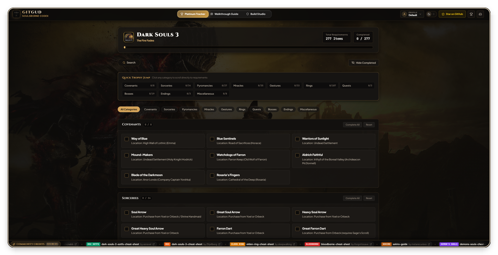
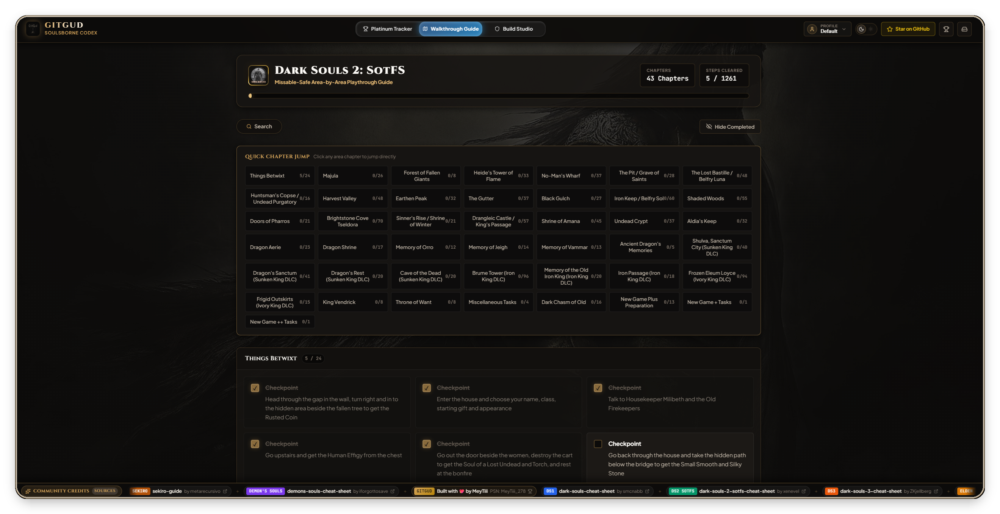
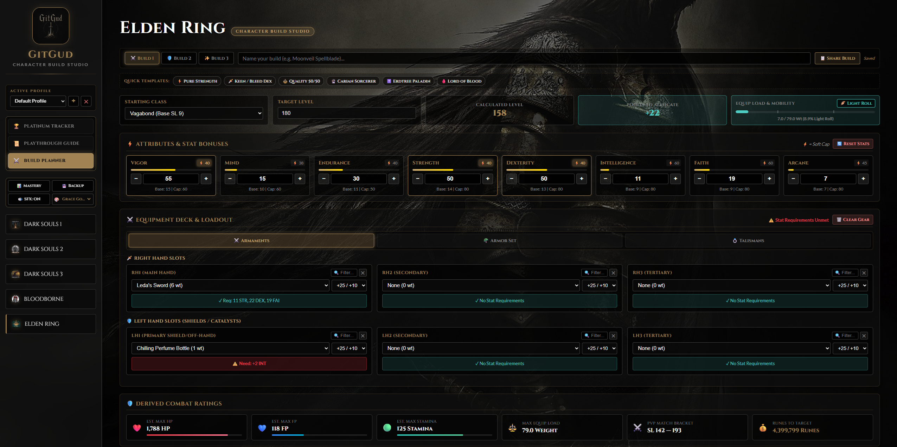

  

<h1 align="center">GitGud Soulsborne Assistant & Platinum Tracker</h1>

  <strong>Interactive web application for tracking Platinum trophies, area checklists, and character builds across Soulsborne titles.</strong>

  <a href="https://psnprofiles.com/MeyTiii_278"><strong>PSN Profile</strong></a>

---

## Supported Games

- [x] **Dark Souls: Remastered** (All trophies, Knight's Honor, Spells, Covenants, Ascensions)
- [x] **Dark Souls II: Scholar of the First Sin** (All Hexes, Spells, Bosses, Gestures, DLC included)
- [x] **Dark Souls III: The Fire Fades Edition** (All Rings, Spells, Covenants, Gestures, Bosses)
- [x] **Bloodborne** (Hunter's Essence, Hunter's Craft, Chalice Dungeons, Bosses)
- [x] **Demon's Souls (PS5 Remake)** (Sage's Trophy, Saint's Trophy, King of Rings, World/Character Tendencies)
- [x] **Elden Ring** (Legendary Armaments, Talismans, Spells, Ashen Remains, Endings)
- [x] **Elden Ring: Nightreign** (Nightfall Expeditions, Sovereigns, Hero Mastery, Relics)
- [x] **Sekiro: Shadows Die Twice** (Prosthetics, Skills, Ninjutsu, Gourd Seeds, Prayer Beads)
- [x] **Lies of P** (Bosses, Collectibles, Records, Upgrades, Quests)

---

## Features

### 1. Platinum Tracker

  

- **Item & Quest Checklists**: Track trophies, boss defeats, weapons, spells, rings, covenants, and endings.
- **NPC Questline Routing**: Step-by-step triggers with lockout warnings.
- **Trophy Navigation Grid**: Jump to any trophy with live completion counters (`[ completed / total ]`).
- **Batch Actions**: Complete or reset specific categories in one click.

### 2. Walkthrough & Progression Guides

  

- **Area-by-Area Routes**: Chronological progression through each location.
- **Missable Flags**: Explicit warnings for missable items, dialogue options, and NPC fail conditions.
- **Navigation & Filtering**: Direct chapter jump navigation and a toggle to hide completed steps.

### 3. Build Planner

  

- **Supported Games**: *Elden Ring, Dark Souls 1, Dark Souls 2, Dark Souls 3, Bloodborne*.
- **Archetype Presets**: Common templates (*Pure Strength, Quality 40/40, Pure Dex, Int/Sorcerer, Faith/Hexer, Arcane*) with baseline level calculations.
- **Equipment & Stat Calculation**: Real-time calculation of HP, FP, Stamina, Equip Load ratio (Light/Medium/Heavy/Overencumbered), PvP level ranges, and level-up costs.
- **Slots**: 3 character build slots per game.

---

## Credits

Walkthrough routes and reference checklists adapted from community resources:

- **Dark Souls**: [Dark Souls Cheat Sheet](https://github.com/smcnabb/dark-souls-cheat-sheet/tree/gh-pages) by [smcnabb](https://github.com/smcnabb)
- **Dark Souls II (SotFS)**: [Dark Souls 2 SOTFS Cheat Sheet](https://github.com/xenevel/dark-souls-2-sotfs-cheat-sheet) by [xenevel](https://github.com/xenevel)
- **Dark Souls III**: [Dark Souls 3 Cheat Sheet](https://github.com/ZKjellberg/dark-souls-3-cheat-sheet) by [ZKjellberg](https://github.com/ZKjellberg)
- **Elden Ring**: [Elden Ring Cheat Sheet](https://sleepwalking.dev/projects-things/elden-ring-cheat-sheet/) by [sleepwalking](https://sleepwalking.dev/)
- **Bloodborne**: [Bloodborne Cheat Sheet Complete Edition](https://github.com/iforgottosave/bloodborne-cheat-sheet-complete-edition) by [iforgottosave](https://github.com/iforgottosave)
- **Sekiro: Shadows Die Twice**: [Sekiro Guide & Checklist](https://github.com/metarecursivo/Sekiro) by [metarecursivo](https://github.com/metarecursivo)
- **Demon's Souls**: [Demon's Souls Cheat Sheet](https://github.com/iforgottosave/demons-souls-cheat-sheet) by [iforgottosave](https://github.com/iforgottosave)
