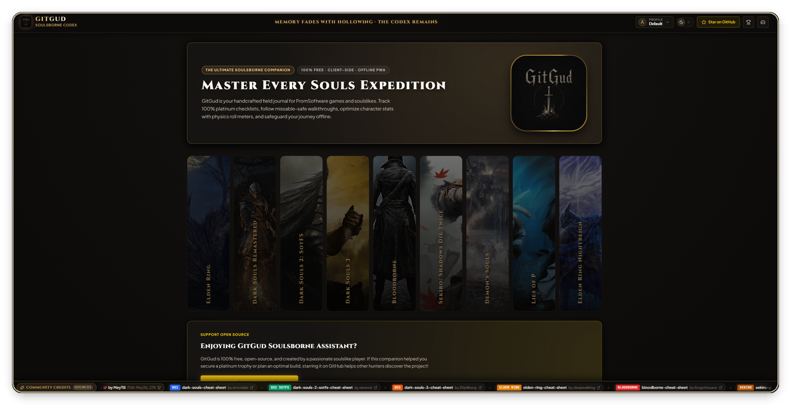
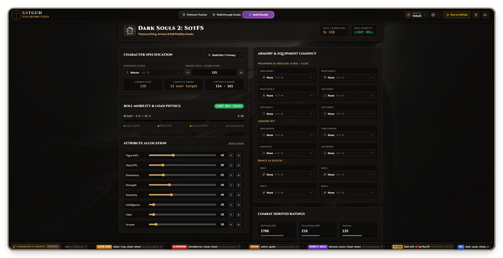

  

<h1 align="center">GitGud Soulsborne Assistant & Platinum Tracker</h1>

  <a href="https://meytiii.github.io/gitgud-platinum-tracker/"><strong>Live App</strong></a>

  A companion web app for tracking Platinum trophies, area checklists, and character builds across Soulsborne games.

  <a href="https://psnprofiles.com/MeyTiii_278"><strong>PSN Profile</strong></a>

  

---

## Supported Games

- [x] **Dark Souls: Remastered** (All trophies, Knight's Honor, spells, covenants, ascensions)
- [x] **Dark Souls II: Scholar of the First Sin** (All hexes, spells, bosses, gestures, DLC included)
- [x] **Dark Souls III: The Fire Fades Edition** (All rings, spells, covenants, gestures, bosses)
- [x] **Bloodborne** (Hunter's Essence, Hunter's Craft, Chalice Dungeons, bosses)
- [x] **Demon's Souls (PS5 Remake)** (Sage's Trophy, Saint's Trophy, King of Rings, tendencies)
- [x] **Elden Ring** (Legendary armaments, talismans, spells, spirit ashes, endings)
- [x] **Elden Ring: Nightreign** (Nightfall expeditions, sovereigns, hero mastery, relics)
- [x] **Sekiro: Shadows Die Twice** (Prosthetics, skills, ninjutsu, gourd seeds, prayer beads)
- [x] **Lies of P** (Bosses, collectibles, records, upgrades, quests)

---

## Features

### 1. Platinum Tracker

  

- **Checklists & Collectibles**: Track trophies, bosses, weapons, spells, rings, covenants, and endings.
- **NPC Questlines**: Step-by-step quest routing with warnings before lockout triggers.
- **Quick Jump Grid**: Jump directly to any category with live completion counters (`[ completed / total ]`).
- **Batch Actions**: Mark off or reset entire categories in one click.

### 2. Walkthrough & Progression Guides

  

- **Area-by-Area Routes**: Chronological progression through every location in recommended order.
- **Missable Warnings**: Clear flags for missable items, dialogue branches, and NPC fail states.
- **Navigation & Filtering**: Direct chapter jump navigation and a toggle to hide finished steps.

### 3. Build Studio

  

- **Supported Games**: *Elden Ring, Dark Souls 1, Dark Souls 2, Dark Souls 3, Bloodborne*.
- **Armory & Loadouts**: Full gear setups across 3 right-hand and 3 left-hand slots, armor pieces, and 4 ring slots.
- **Equip Load & Roll Physics**: Live load ratio calculations (Light ≤30%, Medium ≤70%, Heavy ≤100%, Overencumbered) with roll status.
- **Stat & Level Planning**: Attribute sliders calculating Soul/Rune level, HP, FP, stamina, PvP matching brackets, and level costs.
- **Build Slots**: Save up to 3 character loadouts per game.

---

## Credits

Walkthrough routes and checklists are based on community cheat sheets:

- **Dark Souls**: [Dark Souls Cheat Sheet](https://github.com/smcnabb/dark-souls-cheat-sheet/tree/gh-pages) by [smcnabb](https://github.com/smcnabb)
- **Dark Souls II (SotFS)**: [Dark Souls 2 SOTFS Cheat Sheet](https://github.com/xenevel/dark-souls-2-sotfs-cheat-sheet) by [xenevel](https://github.com/xenevel)
- **Dark Souls III**: [Dark Souls 3 Cheat Sheet](https://github.com/ZKjellberg/dark-souls-3-cheat-sheet) by [ZKjellberg](https://github.com/ZKjellberg)
- **Elden Ring**: [Elden Ring Cheat Sheet](https://sleepwalking.dev/projects-things/elden-ring-cheat-sheet/) by [sleepwalking](https://sleepwalking.dev/)
- **Bloodborne**: [Bloodborne Cheat Sheet Complete Edition](https://github.com/iforgottosave/bloodborne-cheat-sheet-complete-edition) by [iforgottosave](https://github.com/iforgottosave)
- **Sekiro: Shadows Die Twice**: [Sekiro Guide & Checklist](https://github.com/metarecursivo/Sekiro) by [metarecursivo](https://github.com/metarecursivo)
- **Demon's Souls**: [Demon's Souls Cheat Sheet](https://github.com/iforgottosave/demons-souls-cheat-sheet) by [iforgottosave](https://github.com/iforgottosave)
